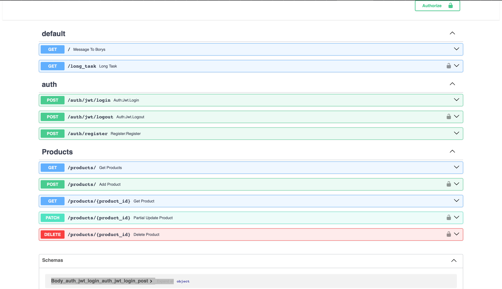
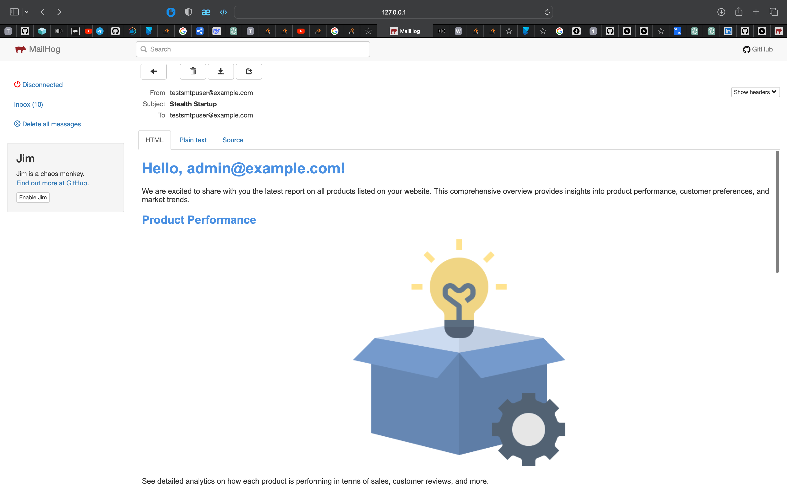

# Stealth Startup Homework

## Introduction

These are test tasks that I had to implement for Borys as part of a project for a stealth startup. The application allows users to create and manage products with different roles like customer, seller, and admin, featuring JWT-Cookie based authentication. (Only seller and admin can create products. Seller can delete/update only its own products, while admin can operate with every product.)

## Table of Contents

- [Installation](#installation)
- [Usage](#usage)
- [Features](#features)
- [Dependencies](#dependencies)
- [Configuration](#configuration)
- [Documentation](#documentation)
- [Examples](#examples)


## Installation

There are two methods to install the project:

### Using Poetry

1. Install Poetry:
   ```
   pip install poetry
   ```
2. Activate the Poetry shell:
   ```
   poetry shell
   ```
3. Install dependencies:
   ```
   poetry install
   ```
4. Copy the example environment file:
    ```
    cp .env_example .env
    ```
5. Run Redis, Celery and mailhog (inside app folder):
   ```
   poetry run redis-server
   ```
      ```
   poetry run celery -A tasks.tasks:celery worker
   ```
      ```
   mailhog
   ```
    ```
   poetry run uvicorn main:app --reload
    ```
### Using Docker

 Build and run with Docker Compose:
   ```
   docker compose build && docker compose up
   ```


## Usage

All API endpoints are described at `http://127.0.0.1:8000/docs` after running the project.

## Features

- **User Roles**: Three user roles - customer, seller, and admin.
- **Product Management**: Sellers and admins can create products. Sellers can update/delete their own products, while admins have control over all products.
- **Authentication**: JWT-Cookie based authentication system.

## Dependencies

Refer to `pyproject.toml` for a list of project dependencies.

## Configuration

Ensure Docker is installed if you plan to build the project via Docker.

Ensure mailhog smtp server is installed

## Documentation

The project uses docstrings for documentation. Sorry, i didn't have much time to refactor my code :(

## Examples

Examples of using the application are provided in the docs endpoint (`http://127.0.0.1:8000/docs`). For more information or specific examples, feel free to contact me on [LinkedIn](https://www.linkedin.com/in/ihor-protsak-aa04411a6/).


Some images:

Docs



Mailhog

